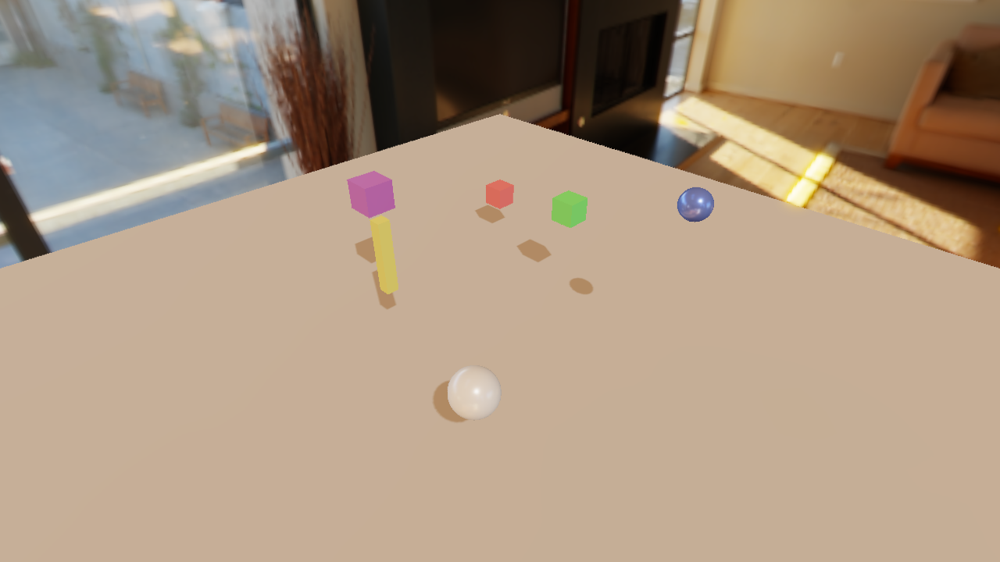
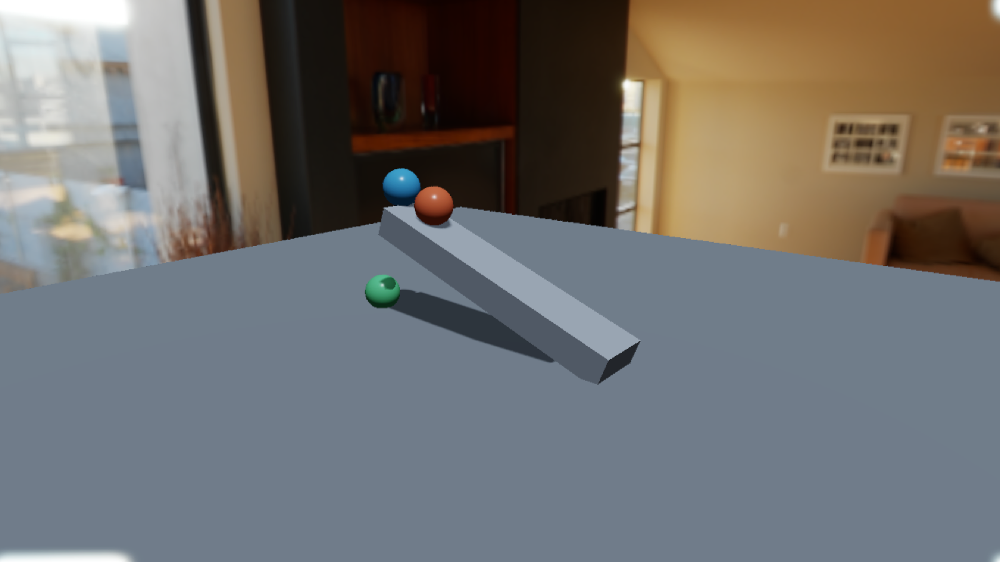

<p align="center">
  
  <br>
  <strong>AETHER ENGINE</strong>
</p>

<p align="center">
  <strong>A real-time 3D engine built to make rendering, editing, and simulation easy to explore.</strong>
  <br>
  <a href="README.md">English</a> · <a href="README.zh-CN.md">简体中文</a>
</p>

---

Aether Engine is an actively developed Rust engine project built on **wgpu**. It combines a real-time renderer, an ECS-based scene model, an interactive scene editor, and repeatable physics and particle simulation. It is a learning and development project—not a production-ready engine.

## What makes it distinct

- **A renderer designed to be inspected:** rendering passes declare the GPU resources they read and write, and a scheduler builds their execution order.
- **One scene model for editing and rendering:** scene entities live in a `hecs` ECS world; an extract step turns that state into render data.
- **Repeatable simulation:** physics uses Rapier3D with fixed-step updates; the launcher provides Play, Pause, and Stop controls.
- **Feature-sized examples:** focused RON scenes make rendering and simulation behavior easier to explore independently.
- **Agent-friendly iteration:** modular features and focused checks help AI coding agents make targeted changes while keeping results reviewable by people.

## Project structure

| Path | Role |
| --- | --- |
| `crates/aether-engine/` | Engine library: renderer, ECS/scene model, assets, terrain, physics, particles, and time |
| `crates/aether-launcher/` | Windowed launcher, scene browser, editor panels, and runtime controls |
| `scenes/` | RON scenes used as examples and focused feature fixtures |
| `tests/` | Automated checks, visual-test support, and generated test artifacts |
| `docs/engine/` | User-facing engine overview and feature guides |

## Explore the engine

The current renderer includes deferred PBR, image-based lighting, shadows, SSAO, SSR, transparency, tone mapping, bloom, terrain, water, atmosphere, and volumetric clouds. The launcher supports scene selection, hierarchy and inspector panels, transform editing, and simulation controls.

These features are at different levels of maturity. In particular, SSR and SSAO are screen-space effects and cannot represent information outside the visible frame. See the feature guides for behavior, example scenes, and current limitations.

<table>
  <tr>
    <td width="50%"></td>
    <td width="50%"></td>
  </tr>
  <tr>
    <td align="center"><sub>PBR materials and image-based lighting</sub></td>
    <td align="center"><sub>Colored materials and directional shadows</sub></td>
  </tr>
  <tr>
    <td width="50%"></td>
    <td width="50%"></td>
  </tr>
  <tr>
    <td align="center"><sub>Volumetric clouds over terrain</sub></td>
    <td align="center"><sub>Rigid bodies and ramp test scene</sub></td>
  </tr>
</table>

## Documentation

- [Engine documentation and feature guides (currently Simplified Chinese)](docs/engine/README.md)
- [Development roadmap](docs/plans/2026-09-17-non-raytracing-engine-roadmap/index.html)
- [Engineering and verification rules](docs/engineering-governance.md)
- [Visual test workflow](docs/agents/visual-test-workflow.md)

## Run it

Install a stable Rust toolchain and use a GPU/backend supported by wgpu:

```bash
git clone https://github.com/ruochenhua/AetherEngine.git
cd AetherEngine
cargo run -p aether-launcher
```

The launcher opens the scene browser. To open a scene directly:

```bash
cargo run -p aether-launcher -- --scene scenes/24_t3_pbr_material_grid.ron
```

The workspace declares `MIT OR Apache-2.0` in [`Cargo.toml`](Cargo.toml).
