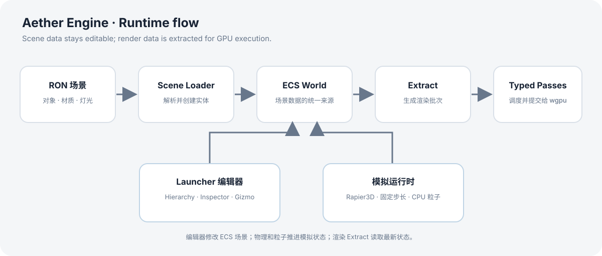

# 架构与代码结构

Aether Engine 是一个 Cargo workspace，拆为引擎库和桌面 Launcher。核心目标是让场景数据、GPU 渲染和编辑器操作各自有清晰边界。

## 技术组成

- **Rust workspace**：统一管理两个 crate、依赖和构建配置。
- **wgpu**：跨平台 GPU 与渲染接口。
- **hecs**：保存场景实体与组件。
- **egui / winit**：Launcher 的编辑器 UI、窗口与输入。
- **Rapier3D**：刚体与碰撞模拟。
- **RON + serde**：可读、可序列化的场景配置。

## 主要目录

```text
crates/
  aether-engine/     引擎核心库
  aether-launcher/   场景浏览器、编辑器与运行入口
scenes/              示例和专项验证场景（RON）
tests/               自动化与视觉测试支持
docs/engine/         面向使用者的引擎文档
```

`aether-engine` 内部按职责拆分为 `renderer`、`ecs`、`scene`、`asset`、`physics`、`particles`、`terrain` 和 `time` 等模块。`aether-launcher` 负责创建窗口、载入场景、处理编辑器交互并驱动运行时。

## 一帧和一次编辑的大致数据流



场景加载器把 RON 配置转换为 ECS 实体和组件。编辑器通过同一份 ECS 数据选择、检查和修改对象；渲染前的 Extract 阶段把场景状态整理成 GPU 使用的渲染数据。保存场景时，再把可持久化状态序列化回 RON。

## 渲染调度

渲染 Pass 声明所需和产出的资源。Pipeline Builder 根据这些声明建立依赖顺序，并通过带类型的资源句柄连接 Pass；调度器按依赖执行。这样资源缺失、依赖环等问题可以在构建管线时发现，而不必完全依赖运行时画面排查。

当前架构聚焦单一实时渲染流程，不等同于完整的多队列通用 Render Graph。具体渲染能力和屏幕空间限制见[渲染功能](rendering.md)。
