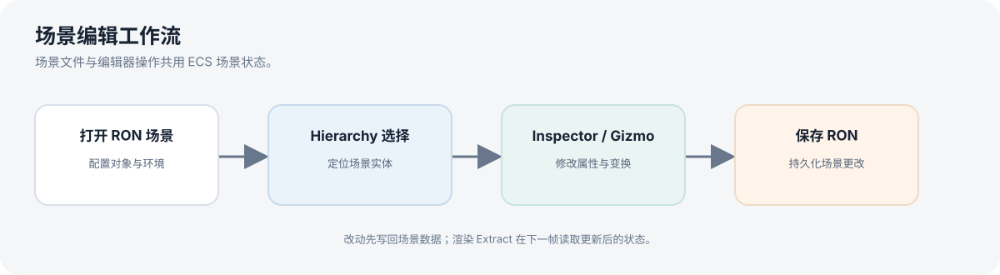

# 编辑器与场景操作

Launcher 是引擎的交互式入口，提供场景浏览和基础编辑能力。它同时也是查看专项场景、观察渲染效果和重复运行模拟的工具。

## 主要面板与交互

- **场景浏览器**：从示例场景中选择要载入的 RON 文件，也可通过命令行直接指定场景。
- **Hierarchy**：浏览场景中的实体并选择对象。
- **Inspector**：查看和修改选中对象的可编辑属性；具体显示项依实体类型而异。
- **视口交互**：鼠标选择对象，使用变换 Gizmo 修改对象位置、旋转或缩放；按住 `Alt` 并拖动鼠标可环视场景。
- **场景文件**：打开和保存 RON 场景；编辑器历史支持常见编辑操作的撤销与重做。

## 常用操作

| 输入 | 操作 |
| --- | --- |
| `Alt` + 左键拖动 | 环视场景 |
| `W A S D` | 相机平面移动 |
| `Q` / `E` | 向下 / 向上移动 |
| 鼠标滚轮 | 调节相机移动速度 |
| 左键单击 | 选择对象 |
| 拖动 Gizmo | 编辑对象变换 |
| `Delete` | 删除选中对象 |

界面布局或快捷键会随开发迭代调整；若输入冲突，优先以 Launcher 当前界面和代码实现为准。

## 建议体验

先打开材质场景 [`24_t3_pbr_material_grid.ron`](../../scenes/24_t3_pbr_material_grid.ron)，在 Hierarchy 中切换对象并检查 Inspector；再尝试打开、编辑并保存一份 RON 场景。

物理模拟的 Play、Pause、Stop 和碰撞体可视化集中说明在[物理与粒子](simulation.md)。
