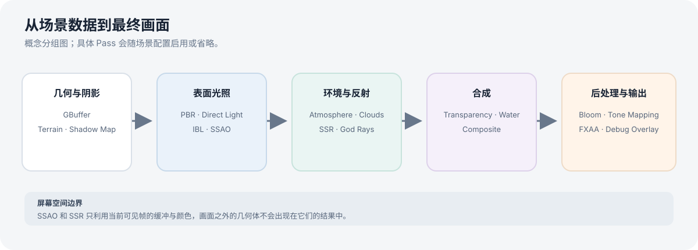
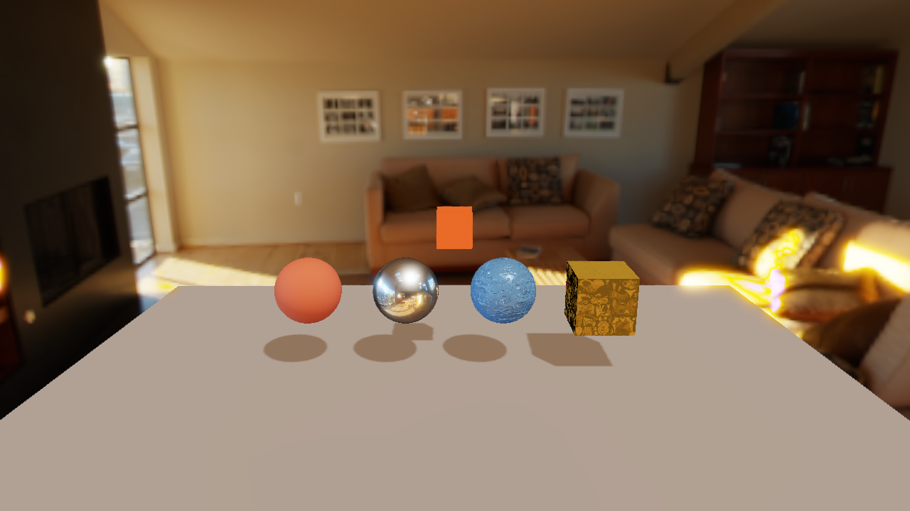
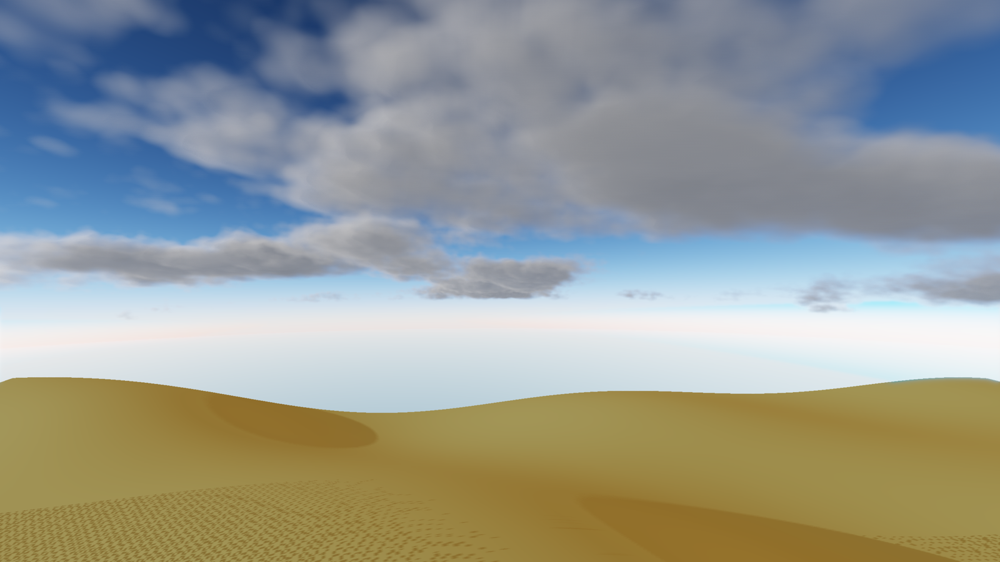

# 渲染功能

渲染器以延迟 PBR 为主干，配合独立 Pass 实现光照、阴影、环境和后处理效果。可直接在 Launcher 中打开本页列出的 RON 场景观察。

## 材质与光照

- PBR 材质参数用于表达基础颜色、粗糙度、金属度等表面属性；材质网格场景用于并排比较不同参数。
- 支持方向光与局部光、阴影贴图，以及基于图像的环境光照（IBL）。
- 材质对比：[`24_t3_pbr_material_grid.ron`](../../scenes/24_t3_pbr_material_grid.ron)
- 阴影：[`03_shadow_demo.ron`](../../scenes/03_shadow_demo.ron)、[`10_csm.ron`](../../scenes/10_csm.ron)
- IBL：[`04_ibl_debug.ron`](../../scenes/04_ibl_debug.ron)
- 多个局部光源：[`23_three_local_lights.ron`](../../scenes/23_three_local_lights.ron)

## 屏幕空间效果

- **SSAO** 根据当前帧的几何缓冲估计局部遮蔽，可增强接触和凹陷处的层次。专项场景：[`05_ssao_debug.ron`](../../scenes/05_ssao_debug.ron)。
- **SSR** 从当前屏幕内容追踪反射，只能反射相机画面中可见的信息。它不能替代 IBL，也无法反射画面之外的物体。专项场景：[`07_ssr_debug.ron`](../../scenes/07_ssr_debug.ron)、[`22_ssr_debug_wall_mirror.ron`](../../scenes/22_ssr_debug_wall_mirror.ron)。

SSAO/SSR 的质量会受深度、法线、分辨率、遮挡和镜头构图影响；这些效果具有明确的屏幕空间边界，不能据单张普通场景截图推断为完整全局光照或镜面反射。

## 环境、地形和透明效果

- 天空与大气：[`11_atmosphere.ron`](../../scenes/11_atmosphere.ron)
- 体积云：[`13_clouds.ron`](../../scenes/13_clouds.ron)
- 地形：[`08_terrain.ron`](../../scenes/08_terrain.ron)
- 水体与反射：[`18_textured_water.ron`](../../scenes/18_textured_water.ron)
- 透明与 IBL 背景：[`t4_transparent_ibl_background.ron`](../../scenes/t4_transparent_ibl_background.ron)、[`t4_transparent_water_composite.ron`](../../scenes/t4_transparent_water_composite.ron)

渲染流程还包含色调映射、Bloom、FXAA 和体积光束等后处理或环境效果。每项能力的实现状态可能不同，建议从专项场景逐个检查。
