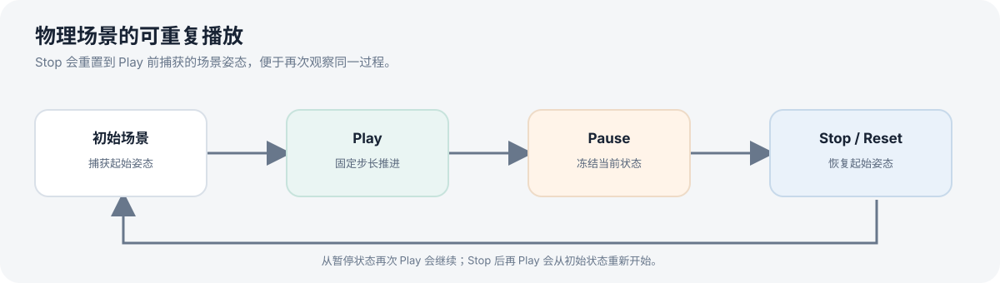
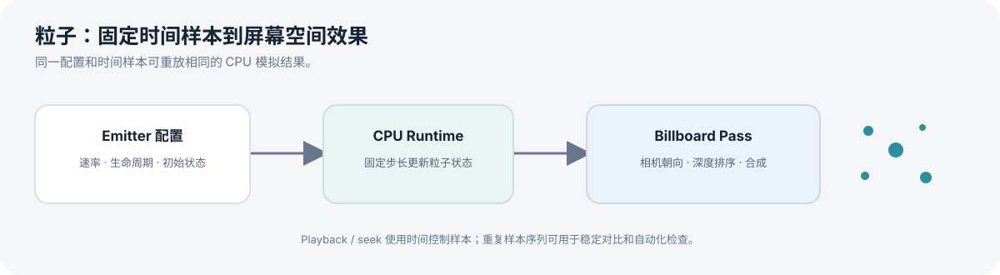

# 物理与粒子

引擎包含 Rapier3D 物理运行时和 CPU 粒子运行时。Launcher 提供播放控制，专项场景用于重复观察模拟结果。

## 物理模拟

- 刚体与碰撞体配置保存在场景对象数据中，由物理系统转换并同步到 Rapier3D。
- 固定步长更新使模拟不直接依赖每帧渲染耗时；运行时还负责物理世界与 ECS 变换之间的同步。
- Launcher 的物理控制区提供 **Play、Pause、Stop**：停止后重置到场景初始状态，再次播放可重新开始。
- 碰撞体调试可视化用于检查物理形状与场景对象的对应关系。

推荐场景：

- [`t6_physics_stack.ron`](../../scenes/t6_physics_stack.ron)：物体堆叠与接触。
- [`t6_physics_ramp.ron`](../../scenes/t6_physics_ramp.ron)：斜坡运动。
- [`t6_physics_debug.ron`](../../scenes/t6_physics_debug.ron)：物理调试视图。

## 粒子

当前粒子运行时以 CPU 模拟为主，支持可重复的时间步推进，并在渲染阶段绘制粒子效果。可从以下场景开始：

- [`t5_particle_dust.ron`](../../scenes/t5_particle_dust.ron)
- [`t5_particle_fire.ron`](../../scenes/t5_particle_fire.ron)
- [`t5_particle_smoke.ron`](../../scenes/t5_particle_smoke.ron)
- [`t5_particle_billboard.ron`](../../scenes/t5_particle_billboard.ron)

## 手动验证建议

打开场景后先记录初始状态，点击 Play 观察运动；暂停后确认物体保持位置；继续播放后点击 Stop，检查是否回到初始状态。物理调试场景还应检查碰撞体是否与可见几何大致匹配。
